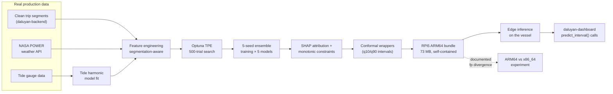

# Ferry Digital Shadow — 5 Production XGBoost Models

Production ML pipeline for the **M/B Dalaray** electric ferry on the Pasig River. Five models cover state-of-charge prediction, motor anomaly detection, and battery anomaly detection — trained on real production telemetry, deployed to a **Raspberry Pi 5 (ARM64)** edge bundle. Part of the M/B Dalaray Digital Shadow thesis project (UP Diliman, EEEI Power Electronics Laboratory).

## Models + headline numbers

| Model | Target | Best metric | Test set |
|---|---|---|---|
| **Trip SOC** | SOC consumed across a trip | **MAE 0.687 %** | 251 segments held-out |
| **Realtime SOC** | Instantaneous SOC | **MAE 0.325 %** | 251 segments held-out |
| **Motor anomaly** | Port + starboard motor health | **96.4 % detection / 0.58 % FPR** | held-out |
| **Battery anomaly (×2 variants)** | Charging / discharging anomalies | **100 % detection** | held-out |

## What makes it production

- **5-seed ensembling** for variance reduction — every model trained 5 times with different seeds, predictions averaged.
- **Conformal prediction wrappers** on Realtime SOC give calibrated **q10 / q90 intervals** (consumed by the operator dashboard's `predict_interval()` calls). Chosen over naive quantile regression for distribution-free coverage guarantees.
- **Optuna TPE hyperparameter search** with 500 logged trials per model.
- **SHAP feature attribution** for interpretability — not just feature-importance bars.
- **Monotonic constraints** where physics demands (e.g. SOC must decrease with energy consumed).
- **C-Mixup augmentation** + Gaussian noise for robustness on small data.
- **NASA POWER weather features** — irradiance, temperature, wind — pulled from the public NASA POWER API.
- **Tide harmonic model** — fits harmonic constituents to local tide gauge data, not just a lookup table.
- **Documented ARM64 vs x86_64 floating-point divergence** — single-segment difference between dev (x86_64) and edge (RPi5 ARM64), reproduced and explained.

## Stack

- **ML:** XGBoost, scikit-learn, Optuna, SHAP, NumPy, pandas, Polars
- **Conformal:** custom q10 / q90 wrappers (see `Models/inference/`)
- **Data:** Parquet, JSON metadata sidecars
- **Edge deploy:** Raspberry Pi 5 (ARM64) — 73 MB bundle, see `Models/rpi5_bundle/`
- **Testing:** pytest

## Pipeline



## Layout

```
Models/
├── config.py                  # Global training + paths config
├── features/                  # Feature engineering (NASA POWER, tide harmonics, segmentation)
├── train/                     # 5 model training scripts
├── evaluate/                  # Metrics, calibration, SHAP, plots
├── tests/                     # pytest suite
├── deploy/                    # Edge packaging
├── rpi5_bundle/               # ★ Self-contained RPi5 ARM64 inference bundle (73 MB)
│   ├── benchmark.py           # Latency / throughput benchmark
│   ├── inference/             # predict.py + predict_interval.py
│   ├── models/                # Trained .json model files
│   ├── config/                # Bundle-local config
│   ├── testdata/              # Smoke-test inputs
│   ├── README.txt             # Bundle-only quickstart
│   └── requirements.txt       # Pinned for ARM64
├── rpi5_experiment/           # ARM64 vs x86_64 fp-divergence experiment
├── docs/                      # Per-model design docs
├── data/                      # Data catalog + manifest (raw data NOT committed)
├── TRAINING_LOG.md            # Iteration journal across all 5 models
└── RETRAIN_LOG.md             # Retraining decisions + outcomes
```

## What's not in this repo

- **Trained model artifacts** (`Models/artifacts/`, ~3 GB) — too large for git; regenerate via `Models/train/*.py`. The deployable subset lives in `Models/rpi5_bundle/`.
- **Raw operational telemetry** — privacy + partner agreement with PEL. The pipeline that produces clean segments lives in [daluyan-backend](https://github.com/FreddieJr-stud/daluyan-backend).
- **ITTC reference PDFs** — possibly copyrighted; obtain from ITTC directly if needed.

## Quick start

```bash
python -m venv venv
source venv/bin/activate                      # Windows: venv\Scripts\activate
pip install -r Models/rpi5_bundle/requirements.txt

# Run the bundle's smoke test
cd Models/rpi5_bundle
python test_inference.py
python benchmark.py
```

## Training journals

- [`Models/TRAINING_LOG.md`](Models/TRAINING_LOG.md) — iteration journal across all 5 models. Hyperparameter choices, validation behavior, debugging notes.
- [`Models/RETRAIN_LOG.md`](Models/RETRAIN_LOG.md) — decisions and outcomes from retraining cycles.

## Related repos

- **[daluyan-backend](https://github.com/FreddieJr-stud/daluyan-backend)** — async FastAPI + Polars + DuckDB pipeline that produces the trip segments these models consume.
- **[daluyan-dashboard](https://github.com/FreddieJr-stud/daluyan-dashboard)** — multi-platform Flutter operator UI + async Python Socket.IO server that runs `predict_interval()` against this bundle in production.

## Status

Active thesis project (UP Diliman, EEEI). Manuscript and supporting code to be published with IEEE conference paper (examiner submission May 2026).

## Authors

Freddie Jr. R. Pagtulingan & S. N. B. Morales · Adviser: Lew Andrew R. Tria
Power Electronics Laboratory, EEEI, UP Diliman
